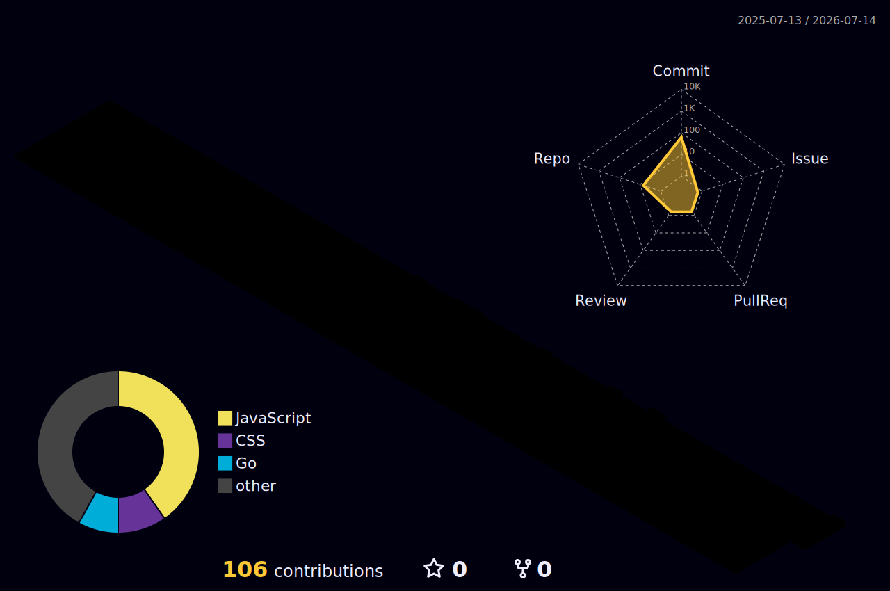

<h1 align="center">Priyanshu Mohan</h1>
<h3 align="center">CS Undergrad · Frontend-Focused Full Stack Developer</h3>

  

  
  

---

### About

- CS undergrad focused on frontend engineering — animated, state-driven UI systems in React, GSAP, and Tailwind
- Comfortable across the stack: Node.js, Express, MongoDB/MySQL, REST APIs
- Completed a 4-week web development internship at CodSoft, shipping 3 independent deployed projects
- Early in my GitHub history — repos here are real, working builds, not tutorials

---

### Featured Projects

**[EMOTE](https://emote-zetchbell.vercel.app/)** — Emotional State Engine & Animated UI System
`React · GSAP · SVG Animation · Tailwind · Vite`
Models 3 core emotions that combine into 8 composite states with time-based decay and dominance-resolution logic, driving independently animated SVG layers instead of static sentiment switching.

**[K72](https://k72-zetchbell.vercel.app/)** — Interactive Agency Experience
`React · GSAP · ScrollTrigger · React Router · Tailwind`
Rebuilt a cinematic agency site from scratch: custom GSAP page-transition engine synced with React Router, plus ScrollTrigger-powered scroll-reveal animations via two reusable custom hooks.

---

### Stack

   
   
  

---

### GitHub Stats

  

---

### Contribution Calendar

  

---

### Currently Learning

- Backend architecture & API design
- Auth (JWT / sessions) done properly
- Databases beyond CRUD
- System design fundamentals

---

### Elsewhere

  
  

<i>Small repos, real projects — building the track record one commit at a time.</i>

