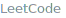

 &nbsp;&nbsp;
 &nbsp;&nbsp;
 &nbsp;&nbsp;

 
 

<table width="100%">
<tr>
<td width="58%" valign="top">

### About

CS undergrad focused on frontend engineering — animated, state-driven UI systems built with React, GSAP, and Tailwind. From REST APIs in Node and Express to schema design in MongoDB and MySQL.

Completed a four-week internship at CodSoft, shipping three independently deployed projects. Currently deepening backend fundamentals — authentication done properly, API design, and system design basics.

</td>
<td width="42%" align="center">

 
Interactive · click to explore

</td>
</tr>
</table>

 
 

### Featured Projects

<table width="100%">
<tr>
<td width="50%" valign="top">

**EMOTE** — Emotional State Engine & Animated UI System &nbsp;&nbsp;&nbsp;&nbsp;&nbsp;&nbsp;&nbsp;&nbsp;&nbsp;&nbsp;&nbsp;&nbsp;
  &nbsp;&nbsp; 
 
`React` `GSAP` `SVG` `Tailwind` `Vite`

---

Models 3 core emotions that combine into 8 composite states with time-based decay and dominance-resolution logic, driving independently animated SVG layers instead of static sentiment switching.

</td>
<td width="50%" valign="top">

**K72** — Interactive Agency Experience &nbsp;&nbsp;&nbsp;&nbsp;&nbsp;&nbsp;&nbsp;&nbsp;&nbsp;&nbsp;&nbsp;&nbsp;&nbsp;&nbsp;&nbsp;&nbsp;&nbsp;&nbsp;&nbsp;&nbsp;&nbsp;&nbsp;&nbsp;&nbsp;&nbsp;&nbsp;&nbsp;&nbsp;&nbsp;&nbsp;&nbsp;&nbsp;&nbsp;&nbsp;&nbsp;&nbsp;&nbsp;&nbsp;&nbsp;&nbsp;&nbsp;&nbsp;&nbsp;&nbsp;
  &nbsp;&nbsp;
 
`React` `GSAP` `ScrollTrigger` `React Router` `Tailwind`

---

Rebuilt a cinematic agency site from scratch: custom GSAP page-transition engine synced with React Router, plus ScrollTrigger-powered scroll-reveal animations via two reusable custom hooks.

</td>
</tr>
</table>

 
 

### Activity

<table width="100%">
<tr>
<td width="50%" valign="top">
<b>Overview</b>
  

</td>
<td width="50%" valign="top">
<b>Contribution Graph</b>
  

</td>
</tr>
</table>

 

 &nbsp;&nbsp;
 &nbsp;&nbsp;
 &nbsp;&nbsp;

Small repos, real projects — building the track record one commit at a time.

